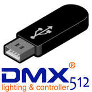

# ioBroker adapter for uDMX

   

Talks to DMX devices using the Anyma uDMX USB adapter.

## Requirements

You need to have an Anyma uDMX compatible USB adapter. Buy one at one of the following sources:

-   [Official Anyma Store](http://www.anyma.ch/store/11-udmx.html)
-   [Clones found on Aliexpress](https://www.aliexpress.com/wholesale?SearchText=USB+dmx)

_IMPORTANT_ The author of this adapter is not related to any of the above companies and does not take any responsibility for the proper working of the hardware bought at those links!

## Install

Before installing, please read the [installation guide of the USB module](https://www.npmjs.com/package/usb#installation).

Especially make sure, that you have libudev installed:

    sudo apt-get install build-essential libudev-dev

## Configuration

### Number of addresses

This is the number of DMX addresses that should be available as states in ioBroker.

Addresses will always start at 1 and go through to the configured number of addresses.

If you have for example a [12 channel DMX decoder for RGB LEDs](https://www.aliexpress.com/item/12CH-DMX-Decoder-Inpot-DC5V-24V-LED-DMX512-controller-high-power-RGB-Controller-Factory-Outlet/920810599.html)
configured with and address offset of 0 (all dip switches to OFF), you would need 12 addresses and they will be numbered in ioBroker as 1 through 12.

A maximum of 512 addresses is possible.

## Compatibility

Compatibility has been tested with Raspberry Pi 3.

## Bug Reports and Feature Requests

Please use the GitHub repository to report any bugs or request new features.

If you require a missing devcies, please provide the type of IC (brand, model, ...) and its address(es) as reported in the adapter configuration.

## TODO

-   Add possibility to combine states into a channel (e.g. "RGB", "RGBW" or "warm white/cold white")

## Changelog

### 0.0.1

-   (UncleSamSwiss) Initial version

## Thanks

This project uses the [usb](https://www.npmjs.com/package/usb) NPM module and was inspired by [homebridge-udmx](https://github.com/Piets/homebridge-udmx/blob/master/index.js).
Thanks to the authors of those packages for their excellent work!
